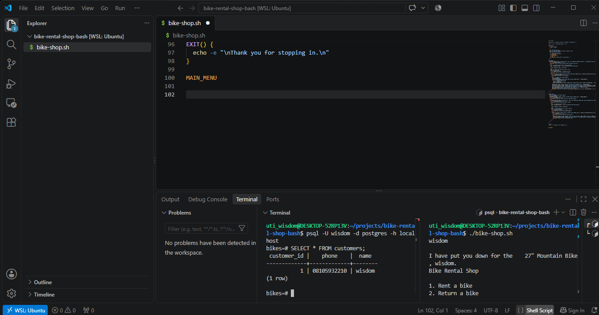
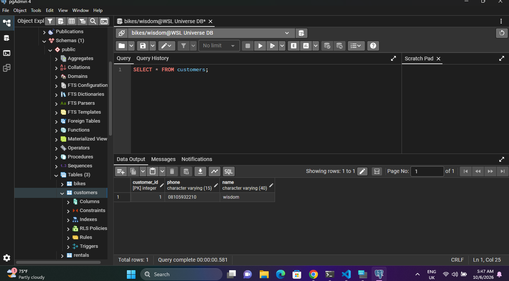

# 🚴 Bike Rental Shop — PostgreSQL + Bash CLI


**An interactive command-line bike rental shop — a Bash script wired to a live PostgreSQL database. Rent a bike, track who has it, return it. Every action writes to real tables. Zero manual entry.**

## Proof

9 bikes. Real customers. Live rental state. Availability flips the moment a bike is rented or returned.




## What It Does

A menu-driven terminal app that talks directly to Postgres. Customers pick a bike, enter a phone number, and the script does the rest — inserts the rental, flips availability, links customer ↔ bike with foreign keys.

```
bikes ──1:N──► rentals ◄──N:1── customers
```

**Tables:**

| Table | Purpose |
|---|---|
| `bikes` | Inventory — type, size, availability flag |
| `customers` | Phone (unique) and name for each renter |
| `rentals` | Who rented what, when, and when it came back |

## Why It's More Than a Class Project

This is the shape of every real booking system:
- **Hotels:** rooms can't be double-booked
- **Car rentals:** availability must reflect live state
- **Library systems:** borrowers ↔ items, with return dates

Foreign keys and `UNIQUE` constraints make orphaned or duplicate data structurally impossible — not just discouraged.

## Features

- 🎫 **Rent a bike** — pick from available inventory, auto-creates the customer if their phone isn't on file
- 🔁 **Return a bike** — looks up their active rental via a 3-table JOIN, stamps `date_returned`, flips the bike back to available
- 🛡️ **Input validation** — non-numeric bike IDs are rejected with a friendly message
- 🧹 **Auto-formatted output** — psql padding stripped and reformatted (`27" Mountain Bike`, not ` 27 | Mountain`)
- 🔐 **Foreign keys** — rentals can't reference a bike or customer that doesn't exist
- 📱 **Unique phone numbers** — the database prevents duplicate customers

## How to Set Up and Run It

**Prerequisites:**
- PostgreSQL installed and running
- A PostgreSQL user with permission to create databases
- Bash (Linux, macOS, or WSL on Windows)

**1. Clone the repo**

```bash
git clone https://github.com/utiwisdom/bike-rental-shop-postgresql-bash.git
cd bike-rental-shop-postgresql-bash
```

**2. Create the database**

```bash
psql -U your_username -d postgres -h localhost
```

Then inside psql:

```sql
CREATE DATABASE bikes;
\c bikes
```

**3. Create the tables** (still inside psql, connected to `bikes`)

```sql
CREATE TABLE bikes (
  bike_id SERIAL PRIMARY KEY,
  type VARCHAR(50) NOT NULL,
  size INT NOT NULL,
  available BOOLEAN NOT NULL DEFAULT TRUE
);

CREATE TABLE customers (
  customer_id SERIAL PRIMARY KEY,
  phone VARCHAR(15) NOT NULL UNIQUE,
  name VARCHAR(40) NOT NULL
);

CREATE TABLE rentals (
  rental_id SERIAL PRIMARY KEY,
  customer_id INT NOT NULL,
  bike_id INT NOT NULL,
  date_rented DATE NOT NULL DEFAULT NOW(),
  date_returned DATE,
  FOREIGN KEY (customer_id) REFERENCES customers(customer_id),
  FOREIGN KEY (bike_id) REFERENCES bikes(bike_id)
);

INSERT INTO bikes (type, size) VALUES
  ('Mountain', 27), ('Mountain', 28), ('Mountain', 29),
  ('Road', 27), ('Road', 28), ('Road', 29),
  ('BMX', 19), ('BMX', 20), ('BMX', 21);
```

Exit psql with `\q`.

**4. Configure your database credentials**

Edit the `PSQL` line at the top of `bike-shop.sh` to match your user:

```bash
PSQL="psql -X -U your_username -d bikes -h localhost --tuples-only -c"
```

To avoid typing your password on every query, set up `~/.pgpass`:

```bash
echo "localhost:5432:bikes:your_username:your_password" > ~/.pgpass
chmod 600 ~/.pgpass
```

**5. Run the shop**

```bash
chmod +x bike-shop.sh
./bike-shop.sh
```

## Sample Walkthrough

```
~~~~~ Bike Rental Shop ~~~~~

Bike Rental Shop

1. Rent a bike
2. Return a bike
3. Exit
1

Here are the bikes we have available:
1) 27" Mountain Bike
2) 28" Mountain Bike
3) 29" Mountain Bike
...

Which one would you like to rent?
1

What's your phone number?
555-5555

What's your name?
Me

I have put you down for the 27" Mountain Bike, Me.
```

## Sample Queries

**Who has what right now:**

```sql
SELECT c.name, b.type, b.size, r.date_rented
FROM rentals r
JOIN customers c USING(customer_id)
JOIN bikes b USING(bike_id)
WHERE r.date_returned IS NULL;
```

**Currently available bikes:**

```sql
SELECT bike_id, type, size FROM bikes WHERE available = true ORDER BY bike_id;
```

**Full rental history:**

```sql
SELECT r.rental_id, c.name, b.type, b.size, r.date_rented, r.date_returned
FROM rentals r
JOIN customers c USING(customer_id)
JOIN bikes b USING(bike_id)
ORDER BY r.rental_id;
```

## Stack

PostgreSQL · Bash · SQL · WSL · psql

## Skills Demonstrated

Relational schema design · Foreign keys · 3-table JOINs · Bash scripting (functions, loops, `case`, regex validation) · Input handling · `sed` text formatting · Menu-driven CLI design · Idempotent queries · Database-backed application state

## Author

**Wisdom Oghenevwede Uti** — Aspiring Data Engineer · ALX Data Engineering Graduate · Secondary School Teacher · ALX Volunteer Mentor

[LinkedIn](https://www.linkedin.com/in/uti-wisdom-286602228/) · [GitHub](https://github.com/utiwisdom) · [Portfolio](https://datascienceportfol.io/wisdomuti8)

---
Built as part of the freeCodeCamp Relational Database Certification. MIT License.
